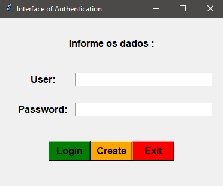

# Advanced Authentication - Python
#### Programa de autenticação avançada com Python e MySQL

* 💬 Descrição e objetivo: Programa em python para gerenciar a entrada de
usuários em um sistema, é executado uma consulta no banco de dados para verificar se o usuario
inserido tem acesso. Possui arquivo que é executado no terminal e arquivo com
interface gráfica.

#### 🚧  Status do Projeto 🚀 Finalizado mas aceita melhorias...  🚧

Tabela de conteúdos
=================
<!--ts-->
   * [Sobre](#Descrição)
   * [Tabela de Conteudo](#tabela-de-conteudo)
   * [Pré Requisitos](#pre-requisitos)
   * [Configurações](#Configurações)
   * [Tecnologias](#tecnologias)
   * [Autor](#autor)
<!--te-->
<br>

* Interface



### Pré-Requisitos

Antes de começar, você vai precisar ter instalado em sua máquina as seguintes ferramentas:
[Python](https://www.python.org/downloads/), [Xampp](https://www.apachefriends.org/pt_br/download.html), [HeidiSQL](https://www.heidisql.com/download.php) ou servidor e ferramenta de
banco de dados compatível com SQL.<br>
Além disto é bom ter um editor para trabalhar com o código como o [PyCharm](https://www.jetbrains.com/pt-br/pycharm/download/).

### 🎲 Configurações

```bash
# Fazer a instalação do Python versão 03 ou superior

# Fazer a instalação do Xampp e iniciar o servidor MySQL

# Instalar o HeidiSQL e criar uma sessão de banco de dados

# Executar o arquivo authentication.sql na pasta do programa e rodar o código no HeidiSQL

# Instalar a biblioteca de criptografia do python
$ pip install bcrypt

# Instalar a biblioteca de banco de dados MySQL do python
$ pip install MySQLdb

# Execute qualquer dos dois arquivos de autenticação
```

### 🛠 Tecnologias

As seguintes ferramentas foram usadas na construção do projeto:

- [Python](https://www.python.org/)
- [MySQL](https://www.mysql.com/)
- [Xampp](https://www.apachefriends.org/pt_br/download.html)
- [HeidiSQL](https://www.heidisql.com/download.php)


Autor
---

<a href="https://www.linkedin.com/in/matheus-de-oliveira-teles-da-silva-a83300154/">

<br/>
<sub><b>Matheus de Oliveira</b></sub></a>🚀

Feito por Matheus de Oliveira 👋🏽 Entre em contato!
